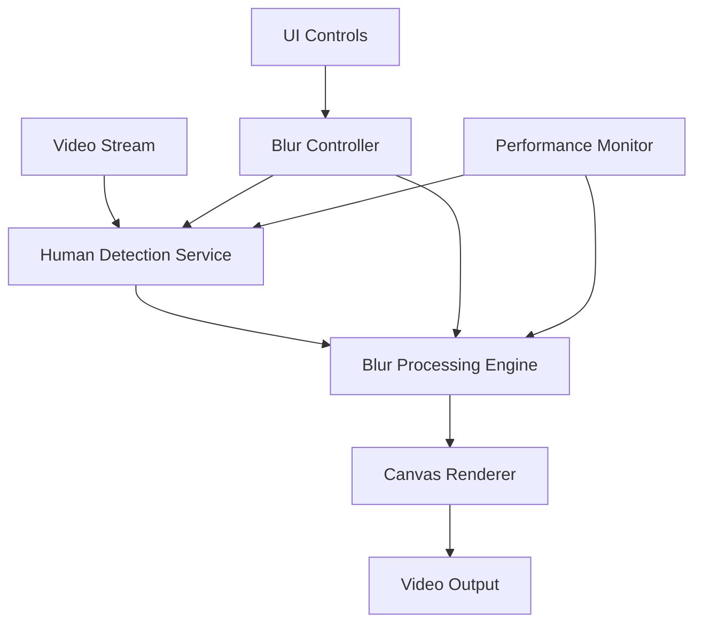

# Design Document

## Overview

The real-time human blurring feature will integrate with the existing video presentation application to provide privacy protection through automatic human detection and selective blurring. The system will use client-side machine learning models to detect human figures in the video stream and apply blur effects using Canvas API processing.

## Architecture

The feature will be implemented as a modular system with the following key components:



The architecture follows a pipeline approach where video frames flow through detection, processing, and rendering stages, with a separate control layer managing user interactions and performance optimization.

## Components and Interfaces

### HumanDetectionService
Responsible for detecting human figures in video frames using TensorFlow.js BodyPix model.

```typescript
interface HumanDetectionService {
  initialize(): Promise<void>;
  detectHumans(imageData: ImageData): Promise<DetectionResult>;
  dispose(): void;
}

interface DetectionResult {
  mask: ImageData;
  confidence: number;
  processingTime: number;
}
```

### BlurProcessingEngine
Handles the application of blur effects to detected human regions.

```typescript
interface BlurProcessingEngine {
  applyBlur(
    originalFrame: ImageData, 
    mask: ImageData, 
    intensity: number
  ): ImageData;
  setBlurIntensity(intensity: number): void;
}
```

### BlurController
Manages the overall blurring workflow and coordinates between components.

```typescript
interface BlurController {
  enable(): void;
  disable(): void;
  setIntensity(intensity: number): void;
  processFrame(frame: ImageData): Promise<ImageData>;
  getStatus(): BlurStatus;
}

interface BlurStatus {
  enabled: boolean;
  intensity: number;
  isProcessing: boolean;
  performance: PerformanceMetrics;
}
```

### BlurControlsUI
React component providing user interface controls for the blur feature.

```typescript
interface BlurControlsProps {
  onToggle: (enabled: boolean) => void;
  onIntensityChange: (intensity: number) => void;
  status: BlurStatus;
}
```

## Data Models

### Configuration
```typescript
interface BlurConfig {
  enabled: boolean;
  intensity: number; // 0-100
  modelPath: string;
  performanceThreshold: number; // max processing time in ms
  fallbackMode: boolean;
}
```

### Performance Metrics
```typescript
interface PerformanceMetrics {
  fps: number;
  averageProcessingTime: number;
  detectionAccuracy: number;
  memoryUsage: number;
}
```

## Error Handling

### Model Loading Errors
- Graceful fallback when TensorFlow.js models fail to load
- User notification with option to retry
- Disable feature if models are unavailable

### Performance Degradation
- Monitor processing time per frame
- Automatically reduce detection frequency if performance drops
- Skip frames when processing takes too long

### Browser Compatibility
- Feature detection for required APIs (WebGL, Canvas, etc.)
- Graceful degradation for unsupported browsers
- Clear messaging when features are unavailable

### Memory Management
- Proper disposal of TensorFlow.js tensors
- Canvas context cleanup
- Web Worker termination

## Testing Strategy

### Unit Tests
- Individual component functionality
- Mock video frames for consistent testing
- Performance benchmarking with synthetic data

### Integration Tests
- End-to-end blur pipeline testing
- UI control integration
- Error handling scenarios

### Performance Tests
- Frame processing speed benchmarks
- Memory usage monitoring
- Browser compatibility testing

### Visual Tests
- Blur effect quality validation
- UI component rendering
- Status indicator accuracy

## Implementation Notes

### Technology Stack
- **TensorFlow.js**: For human detection using BodyPix model
- **Canvas API**: For image processing and blur effects
- **Web Workers**: For offloading heavy computation
- **React**: For UI components integration

### Performance Optimizations
- Use WebGL backend for TensorFlow.js when available
- Implement frame skipping during high load
- Cache detection results for similar frames
- Use requestAnimationFrame for smooth rendering

### Security Considerations
- All processing happens client-side (no video data sent to servers)
- Model files loaded from trusted CDN
- Input validation for user controls

### Browser Support
- Modern browsers with WebGL support
- Fallback messaging for unsupported browsers
- Progressive enhancement approach